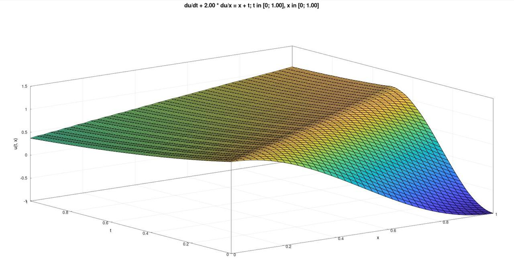

# Solving transport equation

## Equation

$$ \frac{\partial u}{\partial t} + 2\frac{\partial u}{\partial t} = x + t;\ x \in (0; X),\ t \in (0; T)$$

$$u|_{t = 0} = \cos{(\pi x)};\ x \in [0; X]$$
$$u|_{x = 0} = e^{-t};\ t \in [0; T]$$

## How to build

### 0) Make sure you are in the root directory of the project (i.e. Parallel_Programming/02-transport-equation/)

### 1) Build the project

```bash
cmake -B build -DCMAKE_BUILD_TYPE=Release
cmake --build build [--target <tgt>]
```

**tgt** can be **sequential** or **parallel**.

If --target option is omitted, both targets will be built.

> [!NOTE]
> Your compiler must support some features of C++23 such as multidimensional subscript operator and literal suffix for size_t (g++ >= 13, clang++ >= 15)

### 2) How to run

- Sequential program:

    ```bash
    build/sequential --help
    # Allowed options:
    #     --help                Produce help message
    #     --x-dots arg          Set the number of points onX axis of the grid. The
    #                           number of points on T axis of the grid is 2 times
    #                           greater
    #     --plot                Plot solution
    ```

    Example of usage:

    ```bash
    build/sequential --x-dots 100 --plot
    ```

- Parallel program:

    ```bash
    mpirun -c 6 ./build/parallel --help
    # Allowed options:
    #     --help                   Produce help message
    #     --x-dots-per-process arg Set the number of points on X axis of the grid of
    #                              each process. The number of points on T axis of the
    #                              grid is (2 * n_proc) times greater
    #     --plot                   Plot solution
    ```

    Example of usage:

    ```bash
    mpirun -c 6 ./build/parallel --x-dots-per-process 20 --plot
    ```

## Solution plot


