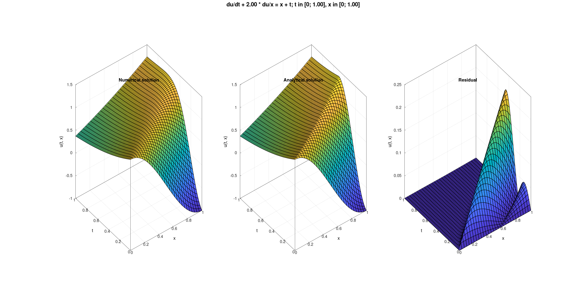
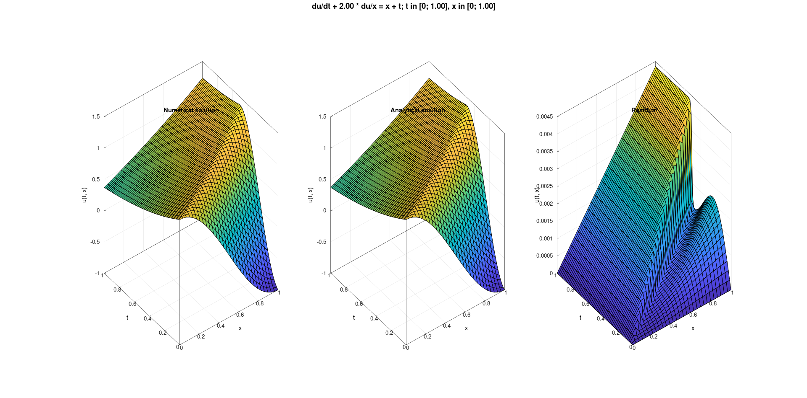
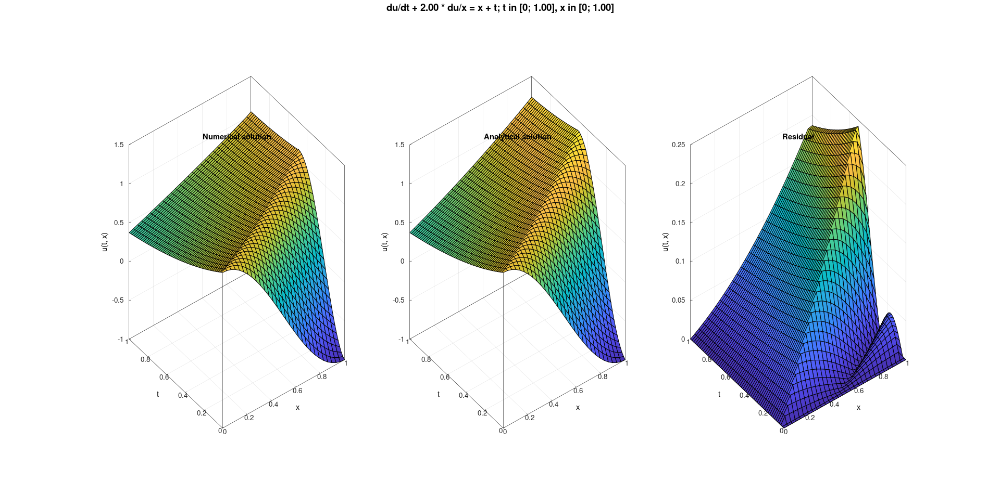

# Solving transport equation

## Equation

$$ \frac{\partial u}{\partial t} + 2\frac{\partial u}{\partial x} = x + t;\ x, t \in (0; 1) $$

$$u|_{t = 0} = \cos{(\pi x)};\ x \in [0; 1]$$

$$u|_{x = 0} = e^{-t};\ t \in [0; 1]$$

## Analytical solution

$$
u(x, t) = \frac{1}{32}(x + 2t)(5x + 2t) +
\begin{cases}
    \cos{(\pi(x - 2t))} - \frac{5}{32}(x - 2t)^2,\ x \geq 2t \\
    e^{\frac{x}{2} - 1} - \frac{1}{32}(x - 2t)^2,\ x < 25
\end{cases},\
x, t \in [0; 1]
$$

## How to build

### 0) Make sure you are in the root directory of the project (i.e. Parallel_Programming/02-transport-equation/)

### 1) Build the project

```bash
cmake -B build -DCMAKE_BUILD_TYPE=Release
cmake --build build [--target <tgt>]
```

**tgt** can be **sequential** or **parallel**.

If --target option is omitted, both targets will be built.

> [!NOTE]
> Your compiler must support some features of C++23 such as multidimensional subscript operator,
literal suffix for size_t and std::unreachable (i.e. g++-12 and clang++-15 or newer)

### 2) How to run

- Sequential program:

    ```bash
    ./build/sequential --help
    # Allowed options:
    #     --help                Produce help message
    #     --t-dots arg          Set the number of points on T axis of the grid
    #     --x-dots arg          Set the number of points on X axis of the grid
    #     --scheme arg          Choose difference scheme:
    #                             - implicit-left-corner;
    #                             - explicit-left-corner;
    #                             - explicit-tree-points;
    #                             - rectangle
    #     --plot                Plot solution
    ```

    Example of usage:

    ```bash
    ./build/sequential --t-dots 20 --x-dots 100 --scheme rectangle --plot
    ```

- Parallel program:

    ```bash
    mpirun -c N ./build/parallel --help
    # Allowed options:
    #     --help                   Produce help message
    #     --t-dots arg             Set the number of points on T axis of the grid.
    #     --x-dots-per-process arg Set the number of points on X axis of the grid for
    #                              each process
    #     --plot                   Plot solution
    ```

    **N** - the number of nodes.

    Example of usage:

    ```bash
    mpirun -c 5 ./build/parallel --t-dots 20 --x-dots-per-process 20 --plot
    ```

## Plots for different schemes

All grids contain 60 points on the T axis and 30 points on the X axis.

- Implicit left corner:

    

- Explicit left corner:

    

- Explicit tree points:

    

- Rectangle:

    
